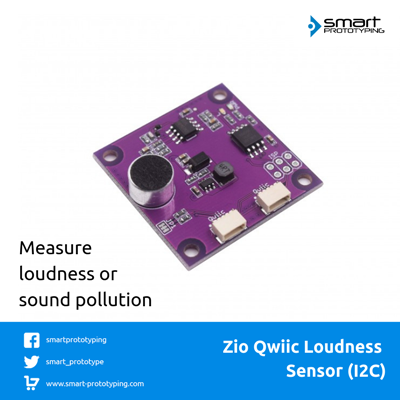

# Zio Qwiic Loudness Sensor I2C

> This product can be available for purchase [here](https://www.smart-prototyping.com/Zio-Qwiic-Loudness-Sensor-I2C).

Check this [RPI Library](https://github.com/l33tllama/Zio-Loudness-Sensor-Python). 

#### Description

In order to create an environment sensor kit, we should not forget a loudness sensor that can measure the noise level. So, this is a Qwiic version (I2C) of Loudness sensor that can output ADC value (0-1023) to tell you the level of the noise. Also you can use this ADC value into other project, like a sound sensor.

We use an MCU (ATTINY85-20SU) as gateway to turn it into an I2C device. we’ve put the necessary code into it, in case you are interested in this part, check our github channel here. 

The loudness value strongly depends on the distance between the sound source and sensor. For example, if you are playing music with your smartphone, when you place the sensor in close proximity to the phone (within 20cm), with low volume settings, the sensor would output a 500 value, but if you put the sensor 2 meters away, the output value might be 200-300 even when the volume is set to very high. It is similar like the microphone in the KTV. 

This is a [Qwiic compatible](https://www.smart-prototyping.com/Qwiic.html) module, which means you can use [Qwiic cable](https://www.smart-prototyping.com/zio-cables) to quickly connect to other qwiic devices, with no soldering and jumper wire connecting!

#### Specification

* Gateway MCU: ATTINY85-20SU
* I2C address: 0x07- 0x78 (Default:0x38)
* Loudness rate Range: 0-1023
* Dimension: 36.3 x 36.5mm
* Weight: 7.3g

#### Links

* [PCB Source file](https://github.com/ZIOCC/Zio-Qwiic-Loudness-Sensor-I2C)
* [PCB schematic](https://github.com/ZIOCC/Zio-Qwiic-Loudness-Sensor-I2C/blob/master/zio%20qwiic%20loudness%20sensor%20schematic.pdf)
* [Demo code](https://github.com/ZIOCC/Zio-Qwiic-Loudness-Sensor-I2C/tree/master/Codes/Qwiic%20Loudness%20Sensor%20Examples)
* [Gateway firmware](https://github.com/ZIOCC/Zio-Qwiic-Loudness-Sensor-I2C/tree/master/Codes/Qwiic_Loudness_Sensor_Firmware/Qwiic_Loudness_Sensor_Firmware)

> ###### About Zio
> Zio is a new line of open sourced, compact, and grid layout boards, fully integrated for Arduino and Qwiic ecosystem. Designed ideally for wearables, robotics, small-space limitations or other on the go projects. Check out other awesome Zio products [here](https://www.smart-prototyping.com/Zio).
